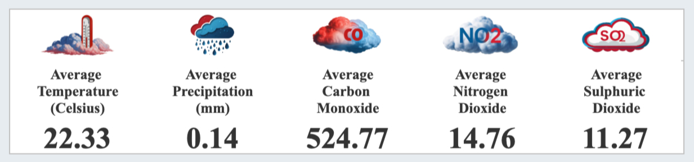
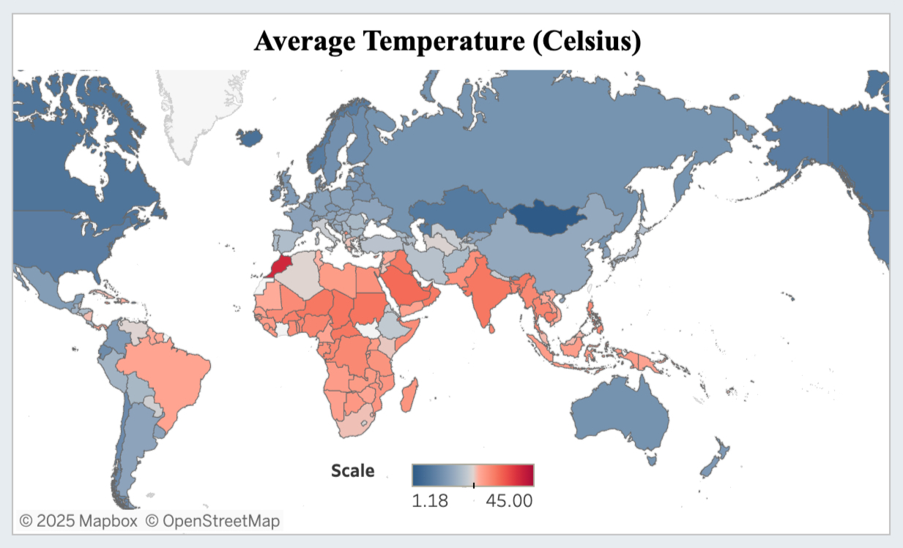
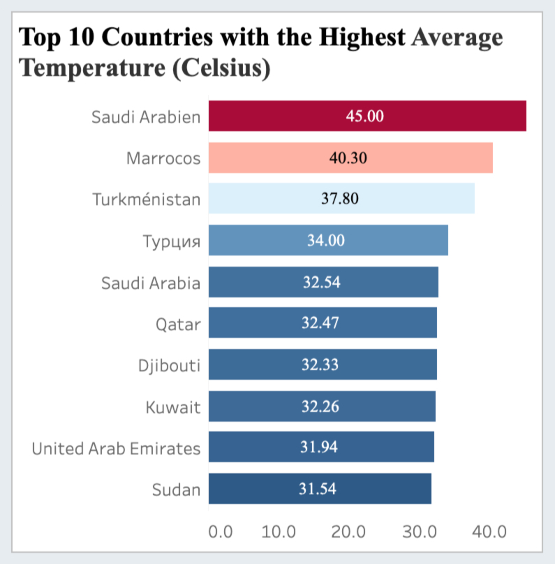
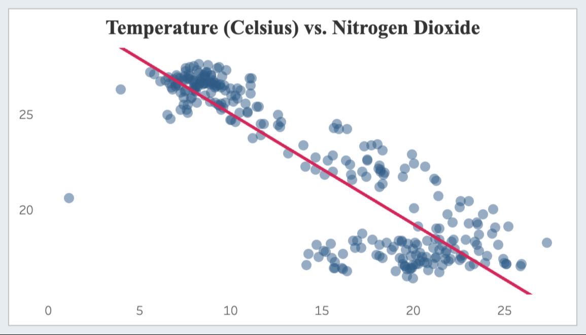

Worald Weather Dashboard (May 2024 - March 2025)
================================================

Exploring Climate Patterns & Environmental Impact

AUTHORS: Meysam Motaharfar 

# Table of Contents
1. [Project Overview](#Project-Overview)
2. [Key Features](#Key-Features)
3. [Dataset Sources and Overview](#Dataset-Source-And-Overview)
4. [Tools Used](#Tools-Used)
5. [Key Questions](#Key-Questions)
6. [Key Insights](#Key-Insights)
7. [Dashboard Overiew](#Dashboard-Overview)
8. [Conclusions](#Conclusions)

# Project Overview

This interactive dashboard provides in-depth analysis of global weather patterns, environmental factors, and geographical variations using the World Weather Dataset. It allows users to explore how climate conditions change across regions and how weather impacts air quality, tourism, and broader environmental trends.

# Key Features

Here are the key features of the dashboard:

* Climate Analysis – Study long-term climate trends and seasonal variations in different regions.
* Environmental Impact – Analyze air quality metrics and their correlation with weather parameters.
* Tourism Planning – Identify optimal travel periods based on historical weather conditions.
* Geographical Patterns – Compare weather trends across different continents and countries.

# Data Sources and Overview

For this analysis, I used the World Weather Repository, a continuously updated dataset available [here](https://www.kaggle.com/datasets/nelgiriyewithana/global-weather-repository/data). This dataset contains daily weather data for capital cities worldwide. Unlike forecast data, it offers a comprehensive snapshot of the current weather conditions, providing over 40 features. These include temperature, wind speed, atmospheric pressure, precipitation, humidity, visibility, air quality metrics, and more, making it a valuable resource for climate analysis and related applications.

# Tools Used

* SQL
* Tableau

# Key Questions

Here are the key questions we aim to answer through this interactive dashboard:

* How have long-term climate trends and seasonal variations evolved across different regions?
* What is the relationship between air quality metrics and various weather parameters?
* When are the optimal travel periods based on historical weather conditions?
* How do weather patterns vary across different continents, countries and over time?
* And more

# Key Insights

 

### 1) What are the average trends for key weather conditions and air quality metrics globally?

 

  

 

### 2) How do weather conditions and air quality metrics vary geographically and across different months?

 

  

 

### 3) How do weather conditions and air quality metrics vary over time, both globally and by country?

 

  

 

### 4) Which are the top 10 countries based on weather conditions and air quality metrics?

 

  

 

The ranking chart highlights the following insights regarding weather conditions and air quality metrics across different countries:

* **Saudi Arabia** is the hottest country with the highest UV index and PM10 levels.
* **Lao People's Democratic Republic** experiences the highest precipitation and is the cloudiest nation.
* **Belize** has the highest humidity, while **Mexico** records the highest pressure.
* **Marshall** Islands has the greatest visibility, whereas **Libya** is the windiest country.
* **Iceland** experiences the strongest gusts.
* **Malaysia** has the highest carbon monoxide pollution, **South Korea** leads in nitrogen dioxide, and China in sulfur dioxide levels.
* **Bahrain** has the highest ozone levels, while **Chile** records the highest PM2.5 index.
* **Mongolia** has the highest temperature variation.
* **Jamaica** experiences the greatest fluctuation in precipitation.
* **Cameroon** records the largest humidity variation.
* **Honduras** has the widest pressure fluctuation.
* **United States** sees the greatest changes in cloud coverage.
* **Canada** has the most variable visibility.
* **Burundi** experiences the largest wind and gust variation.
* **Brazil** has the highest UV index fluctuation.
* **Indonesia**, **Iraq**, and **Kiribati** show the largest variations in carbon monoxide, nitrogen dioxide, and sulfur dioxide, respectively.
* **Bahrain**, **Saudi Arabia**, and **Chile** have the greatest fluctuations in ozone, PM10, and PM2.5 levels, respectively.

### 5) What is the correlation between weather conditions and air pollutants?

 

  

 

The scatter plot analysis reveals key relationships between weather conditions and air pollutants:

* **Temperature** exhibits a **strong inverse correlation** with air pollution—lower temperatures are associated with higher levels of carbon monoxide, nitrogen dioxide, sulfur dioxide, and other pollutants.
* **Precipitation** shows a **weak inverse correlation**—lower rainfall corresponds to slightly higher pollutant levels.
* **Humidity** demonstrates a **moderate positive correlation**—higher humidity is linked to increased air pollution levels.
* **Pressure** has a **moderate positive correlation**—higher atmospheric pressure is associated with elevated pollutant concentrations.
* **Cloud Coverage** shows a **moderate positive correlation**—greater cloud cover corresponds to higher air pollution levels.
* **Wind** exhibits a **weak inverse correlation**—stronger winds help disperse pollutants and reduce air pollution.
* **UV Index** has a **moderate inverse correlation**—lower UV levels are linked to increased pollution levels.
  
These findings indicate that colder, humid, and less sunny conditions tend to worsen air quality, while wind plays a minor role in improving it, and precipitation has only a limited impact.

# Dashboard Overview

Here is a preview of the dashboard:

 

  

 

You can explore the interactive dashboard [here](https://public.tableau.com/app/profile/meysam.motaharfar/viz/WorldWeatherDashboard/Dashboard2).

 

# Conclusions

